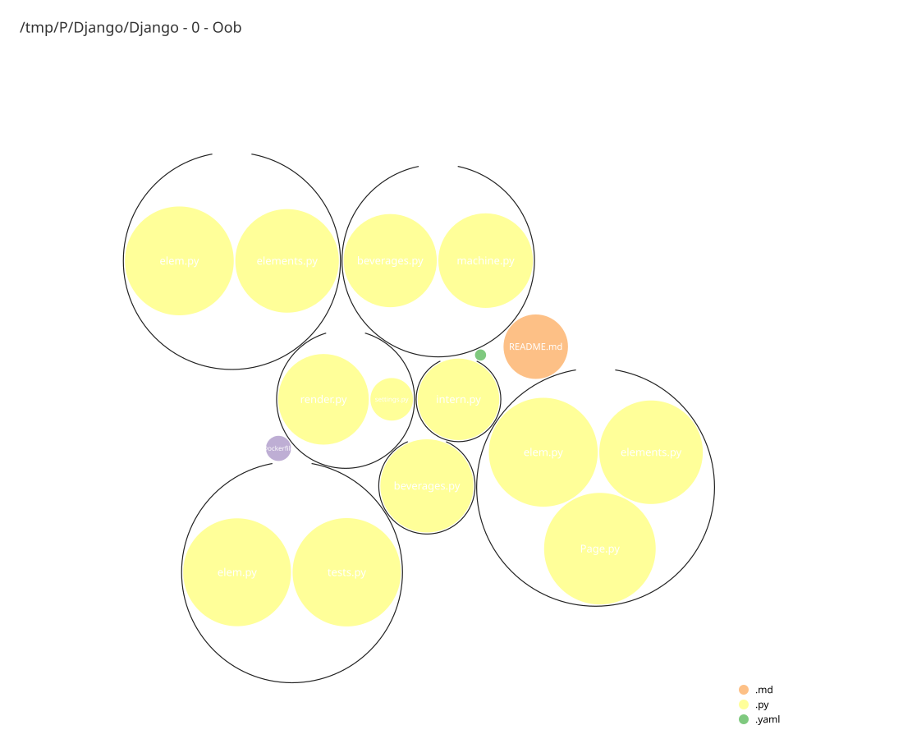

# Django - 0 - Oob

Object-oriented Python day of the **42 Django Piscine**. Templating with a
`.template` file, class design, `__init__`/`__str__`/`__del__`, abstract base
classes, static/class methods, and a small HTML element library built with
composition.

Exercises `ex00` → `ex06`. Run with `docker compose up --build`.

## Map

*Generated with `lsphere`.*
